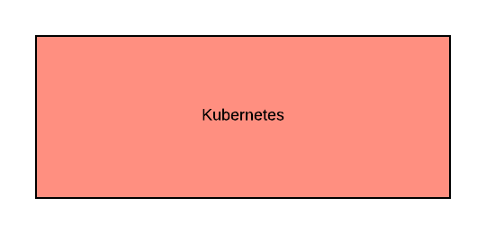
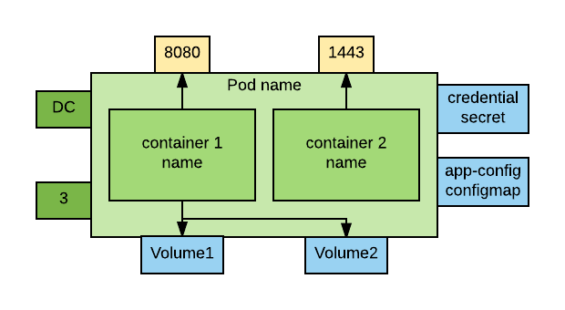
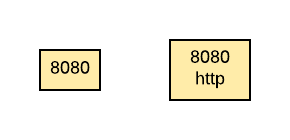
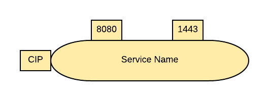
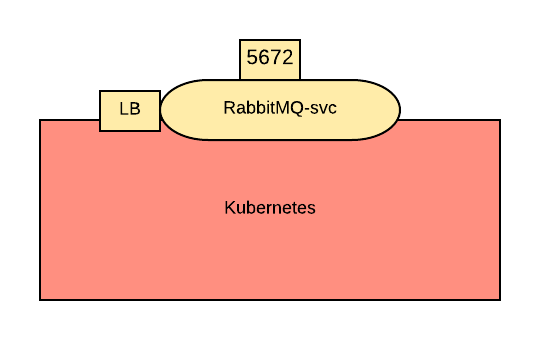
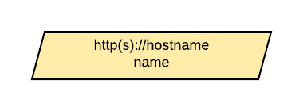
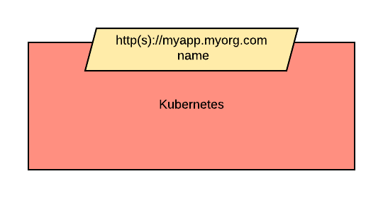
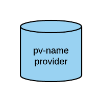
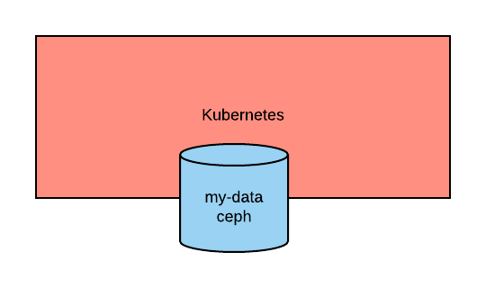
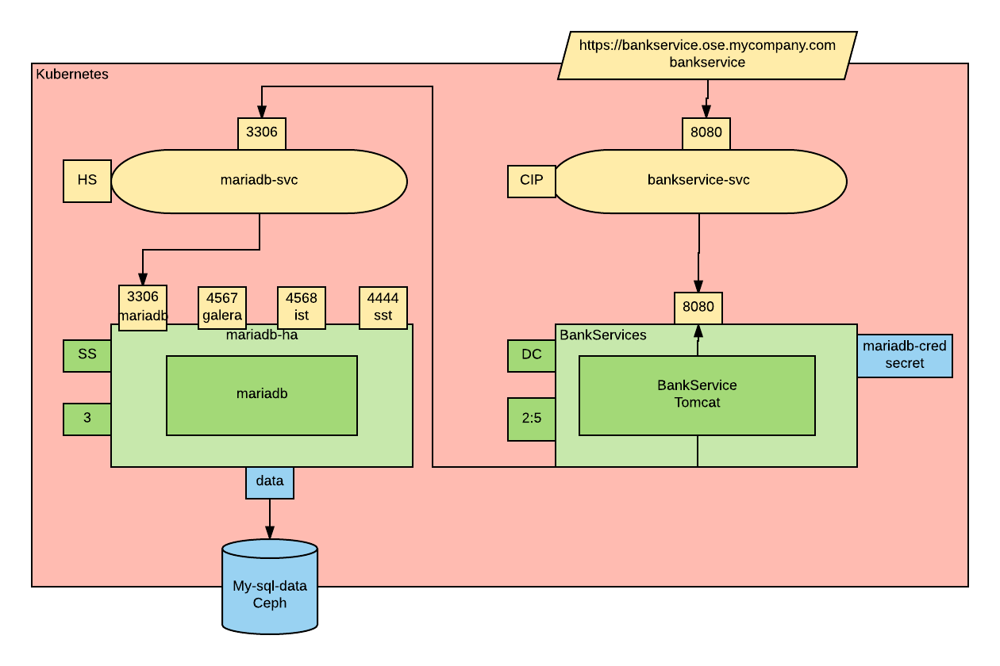

# kdl

A notation to describe OpenShift API objects

## Introduction
The purpose of this document is to illustrate a notation for OpenShift API objects. Openshift API objects can be used to describe how a solution will be deployed in openshift.
The idea is that if we can establish a common language to describe how applications are deployed this will simplify communications and speed app the app onboarding processes.

To better explain the objective we can draw a parallel to UML, which had several languages to describe different aspects of an application architecture. A difference with UML is though that here we don’t try to create diagrams that can be used to generate API objects. So we have the opportunity to decide which pieces of information we want to show in the diagrams. As a general rule of thumb we will only display architecturally relevant information.

In general OpenShift API objects cover the following areas:

| Area  | Color convention  | Example  |
|---|---|---|
| OpenShift Cluster  | Red  | The openshift cluster(s) involved in the solution  | 
| Compute  | Green  | Deployment  |  
| Networking  | Yellow  | Service  |  
| Storage  | Blue  | Persistent Volume Claim, Persistent Volume  |    
 

Here is the API object notation convention.

## OpenShift cluster
The openshift cluster is simply represented as a rectangle:

All the other API object will live inside the cluster or at its edges.
There should never be a need to call out individual nodes of an openshift cluster.

## Compute 
The compute objects are the most complex. In general they are represented by a rectangle with badges around it to show additional information. Here is a template:

The central section of the picture represents a pod. In it we can find one or more containers. Both pod and containers should have a name.

On the left side of the pod we have additional compute information. The top badge specify the type of controller for this pod. Here are the types of controllers and their abbreviations:

| Type of controller  | Abbreviation  |  
|---|---|
| Replication Controller  | RC  | 
| Replica Set  | RS  |   
| Deployment  | D  |  
| DeploymentConfig  | DC  | 
| DaemonSet  | DS  |  
| StatefulSet  | SS  |  
| Job | J |

On the bottom we have the cardinality of the instances of that pod. This field assumes different meaning and format depending on the type of controller, here is a reference table:

| Type Of Controller  | Format |  
|---|---|
| Replication Controller  | Can be : - a number if statically set: 3 - a range is controlled by a HPA: 2:5  | 
| ReplicaSet  | Can be : - a number if statically set: 3 - a range is controlled by a HPA: 2:5  |  
| Deployment  | Can be : - a number if statically set: 3 - a range is controlled by a HPA: 2:5  | 
| DeploymentConfig  | Can be : - a number if statically set: 3 - a range is controlled by a HPA: 2:5  |
| DaemonSet  | The node selector: storage-node=true  |
| StatefulSet  | A number: 3  |
| Job  | A number representing the degree of parallelism: 3  |

At the top of the pod we have the exposed ports. You can use the little badges to just show the port number or also add the port name. Here is an example:

These badges are in yellow because the represent networking config.
You can connect each port with the container that is actually exposing that port if relevant. But in most cases this will not be necessary because most pods have just one container.

At the bottom of the pod we have the attached volumes (excluding secrets and configmaps). The name of the volume should be displayed in the rectangle. In most cases these will be persistent volumes. If the volume type is not persistent volume it may be relevant to show it. Also, sometimes it may be important to also show the mount point. Here are examples of acceptable notation:

On the right side of the pod with have volumes that pertain to the configuration of the pod: secrets and configmaps. As for the data volumes, the name of the volume should be indicated, usually it is important to distinguish between configmaps and secrets, so also the type of volume should be indicated and if necessary also the mount point can be shown. Here are some examples:

## Networking
There are two types of networking objects: services and routes (or ingresses in kubernetes).

### Services
A service can be represented with an oval as in the following picture:

On the left side there is a badge representing the type of service. Here are the possible abbreviations

| Type  | Abbreviation  | 
|---|---|---|---|
| Cluster IP  | CIP  | 
| Cluster IP, ClusterIP: None  |  HS a.k.a. Headless Service | 
| Node Port  | NP  | 
| LoadBalancer |  LB |
| External Name  | EN  |
| External IP  |  EIP |  

At the top of the service there are the exposed ports. Same convention applies here as for the compute ports.

The service should be connected to a compute object. This will implicitly define the service selector, so there is no need to have it indicated in the picture.

If a service is allows traffic from the outside of the cluster to internal pods (such as for Load Balancer or Node Port or External IP) it should be depicted on the edge of the cluster.

Same concept applies to services that regulate outbound traffic (such as External Name), although in this case they would probably appear at the bottom of the openshift cluster rectangle.

### Routes/Ingresses 
Routes or Ingresses can be indicated with a parallelogram as in the following picture:

A route shows the route name and potentially the host exposed. A route will be connected to a service.
Routes are always shown at the edge of the openshift cluster. 

## Storage
Storage is used to indicate persistent volumes. The color of storage is blues and it’s shape is a bucket deployed as the following picture:

Storage should indicate the persistent volume name and the storage provider (example NFS, gluster etc...).
Storage lives always at the edge of the cluster because it is a configuration pointing to an externally available storage.

## Putting it all together
In this section we will go over an example of how this notation can be used to describe the deployment of an application.
Our application is an bank service application that uses a mariadb database as its datastore. Being a bank application everything must be in HA.
Here is the deployment diagram:

Notice that the mariadb pod uses StatefulSet and a persistent volume for its data. This pod is not exposed externally to the cluster, but its service is consumed by the BankService app.
The BankService app is a stateless pod controlled by a deployment config which has a secret with the credentials to access the database. It also has a service and a route so that it can accept inbound connection from outside the cluster.
